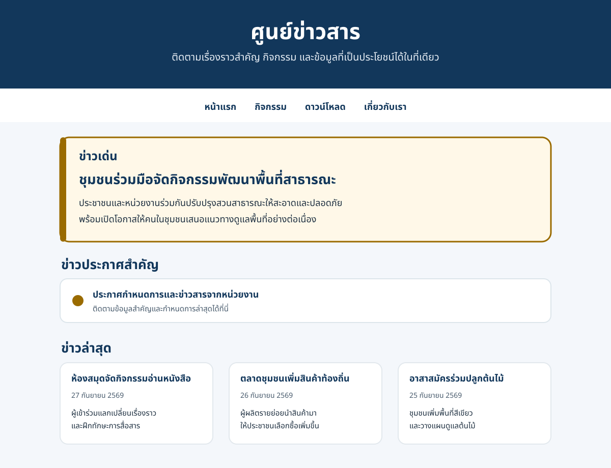

# ศูนย์ข่าวสาร

เว็บไซต์ข่าวภาษาไทยแบบหน้าเดียว รองรับมือถือ แท็บเล็ต และคอมพิวเตอร์

## ภาพหน้าจอ

> ภาพนี้เป็นภาพตัวอย่างประกอบ README ที่วาดจากเนื้อหาและชุดสีของเว็บไซต์ ไม่ใช่ภาพจับหน้าจอจากเบราว์เซอร์

## ฟีเจอร์

- แสดงข่าวเด่น ข่าวประกาศสำคัญ และข่าวล่าสุด 8 รายการ
- ค้นหาข่าวทันทีจากทั้งหัวข้อและเนื้อหาสรุป
- เน้นคำค้นหาในหัวข้อ และแจ้งเมื่อไม่พบข่าว
- ดาวน์โหลดข่าวแต่ละรายการเป็น PDF พร้อมรองรับข้อความภาษาไทย
- เมนู hamburger บนมือถือ และการ์ดข่าวที่ปรับจำนวนคอลัมน์ตามขนาดหน้าจอ

## วิธีเปิดใช้งาน

1. ดาวน์โหลดหรือ clone repository
2. เปิดไฟล์ `index.html` ในเว็บเบราว์เซอร์
3. เชื่อมต่ออินเทอร์เน็ตเพื่อใช้ไลบรารี PDF และฟอนต์ภาษาไทยจาก CDN

หากใช้ VS Code สามารถติดตั้งส่วนขยาย Live Server แล้วเปิด `index.html` ผ่าน Live Server ได้

## เทคโนโลยี

- HTML5
- CSS3
- JavaScript (Vanilla ES6)
- jsPDF และ html2canvas สำหรับสร้าง PDF
- Noto Sans Thai สำหรับแสดงผลภาษาไทยใน PDF
